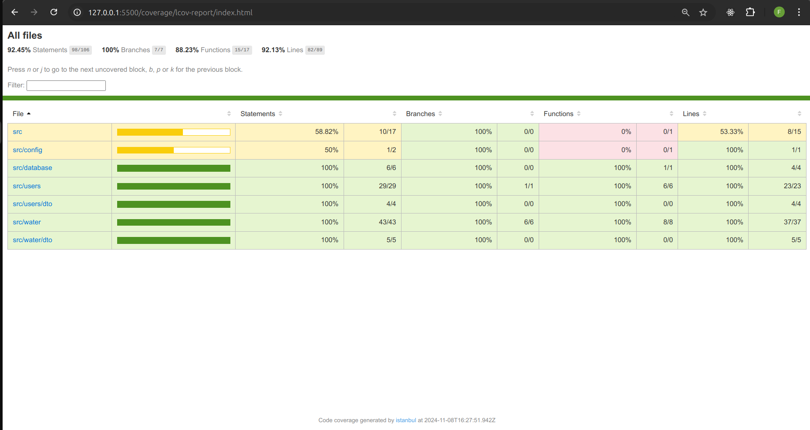

# Back-end

## Tecnologias usadas

  <a href="https://go-skill-icons.vercel.app/">
    
  </a>

<br>
<br>
<br>

# Setup do Projeto

## Configuração do Ambiente

1. Mude o arquivo `.env.example` para `.env`:

   ```bash
   cp .env.example .env
   ```

2. Preencha as variáveis de ambiente com os valores necessários:

   - `DATABASE_URL`: Caminho do banco de dados SQLite. Use o valor padrão `file:./dev.db`.
   - `APP_PORT`: Porta na qual a aplicação será executada. Exemplo: `3000`.

3. Instale as dependências (Usei o yarn, mas, sinta-se livre para usar o npm):

   ```bash
   npm install
   ```

4. Execute as migrações do Prisma para configurar o banco de dados:

   ```bash
   npx prisma migrate dev
   ```

5. O servidor já está pronto para ser executado. Caso der o seguinte erro:

   PrismaClientInitializationError: error: Error validating datasource `db`: the URL must start with the protocol `file:`.
   --> schema.prisma:13
   |
   12 | provider = "sqlite"
   13 | url = env("DATABASE_URL")

   ## Execute esse Comando:

   ```
      export DATABASE_URL="file:./dev.db" && npm run start:dev
   ```

## Para ligar o servidor de desenvolvimento

```bash
# Servidor padrão
npm run start

# Escutando alterações dos arquivos
npm run start:dev
```

## Para rodar os testes

```bash
# Servidor padrão
npm run test

# Escutando alterações dos arquivos
npm run test:watch
```

## Cobertura de testes

```bash
# Servidor padrão
npm run test:cov

```



---

# Front-end

## Tecnologias usadas

  <a href="https://go-skill-icons.vercel.app/">
    
  </a>

<br>
<br>
<br>

# Setup do Projeto

## Configuração do Ambiente

1. Abra a pasta `src/consumo_agua`:
2. Use o Live Server e abra os arquivos HTML para fazer as requisições correta:

   - `public/form-create-user.html`: Formulário de criação de um novo usuário.
   - `public/form-create-consuming-water.html`: Formulário de criação de um consumo de água

3. Inicie o servidor de desenvolvimento do back-end

## Para ligar o servidor de desenvolvimento

```bash
npm run start:dev
```
